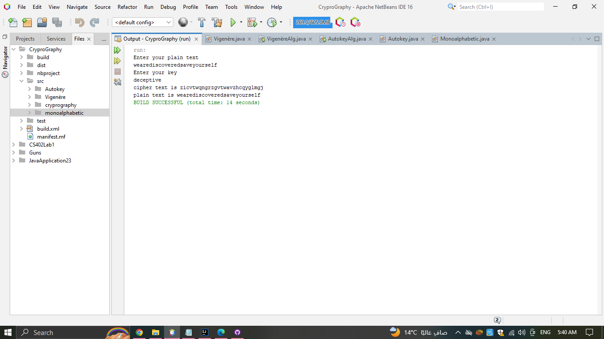

# Cryptography
##Algorithms in Cryptography

### Autokey Cipher
####simplest polyalphabetic substitution cipher
* ideally want a key as long as the message
* with keyword is prefixed to message as key
* knowing keyword can recover the first few letters
* use these in turn on the rest of the message
* but still have frequency characteristics to attack


```
// method to encrypt the plain text and return cipher text.
encryption(plainText,key);
```

```
// method to decrypt the cipher text and return plain text.
decryption(cipherText ,key);
```


