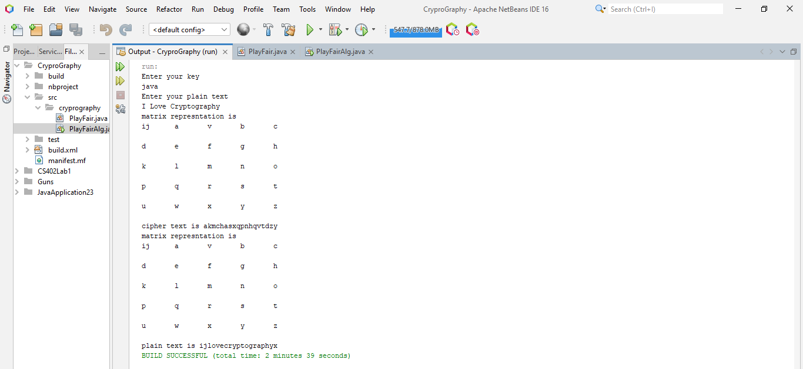

# Cryptography
##Algorithms in Cryptography

###Playfair Key Matrix
* a 5X5 matrix of letters based on a keyword
* fill in letters of keyword (sans duplicates)
* fill rest of matrix with other letters
* eg. using the keyword MONARCHY

### plaintext is encrypted two letters at a time
1. if a pair is a repeated letter, insert filler like 'X’
2. if both letters fall in the same row, replace
   each with letter to right (wrapping back to start
   from end)
3. if both letters fall in the same column, replace
   each with the letter below it (wrapping to top
   from bottom)
4. otherwise each letter is replaced by the letter
   in the same row and in the column of the other
   letter of the pair


```
// method to encrypt the plain text and return cipher text.
playfairEncryption(key, plainText);
```

```
// method to decrypt the cipher text and return plain text.
playfairDecryption(key, cipher Text);
```

