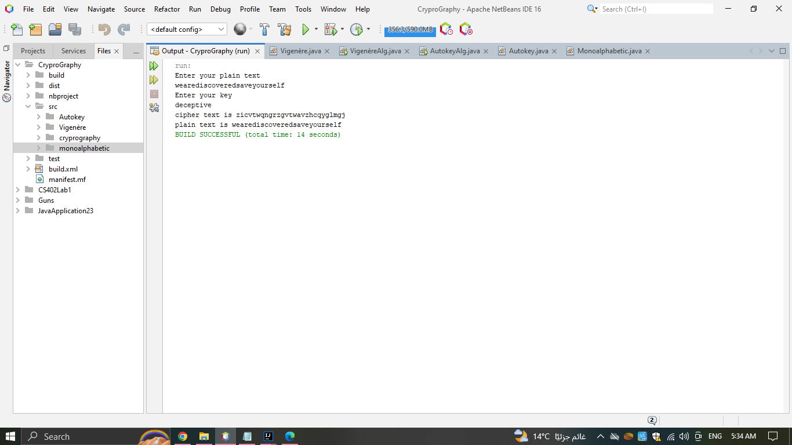

# Cryptography
##Algorithms in Cryptography

### Vigenère Cipher
####simplest polyalphabetic substitution cipher
* effectively multiple caesar ciphers
* key is multiple letters long K = k1 k2 1 ... kd
* ith letter specifies ith alphabet to use
* use each alphabet in turn
* repeat from start after d letters in message
* decryption simply works in reverse


```
// method to encrypt the plain text and return cipher text.
encryption(plainText,key);
```

```
// method to decrypt the cipher text and return plain text.
decryption(cipherText ,key);
```


