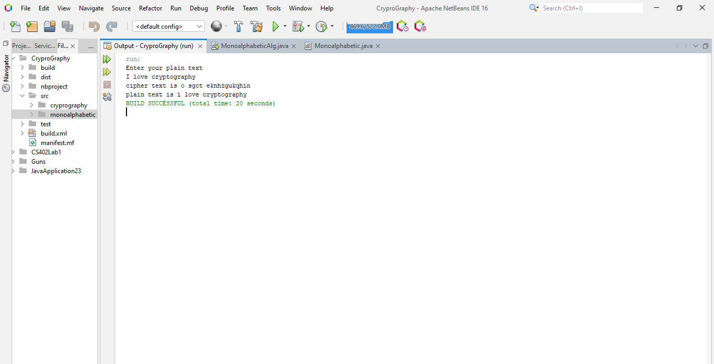

# Cryptography
##Monoalphabetic Cipher

* each plaintext letter maps to a different random
  ciphertext letter

```
// method to encrypt the plain text and return cipher text.
encryption(plainText);
```

```
// method to decrypt the cipher text and return plain text.
decryption(cipherText);
```
